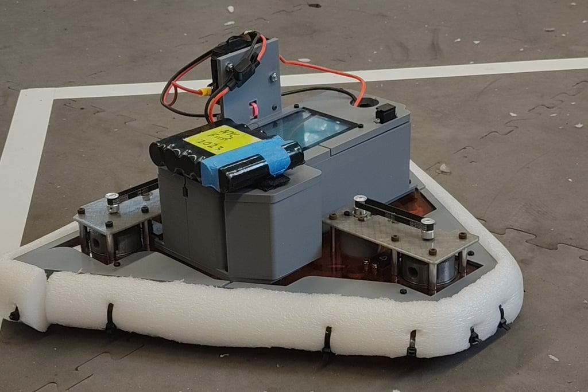
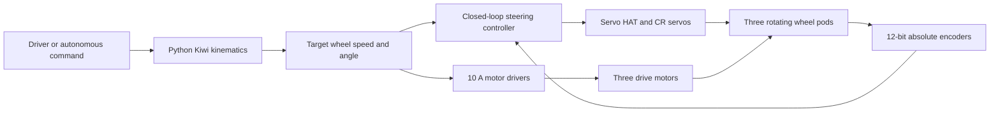
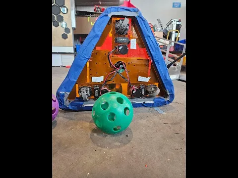
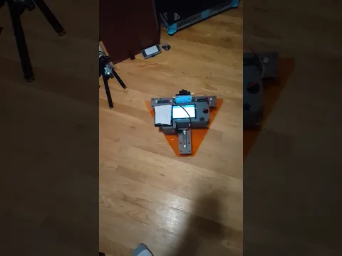
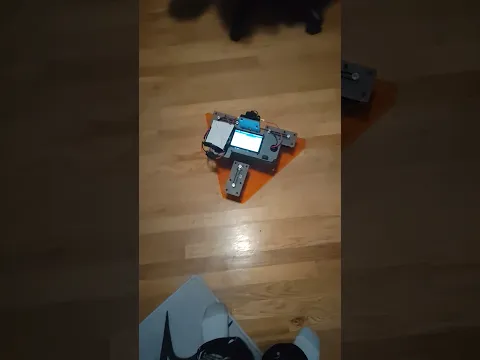

<div align="center">

# Dorito

### A low cost, three module Kiwi swerve drivetrain

   

[Overview](#overview) · [How it works](#how-it-works) · [Prototype results](#prototype-results) · [Project files](#repository-contents)

</div>

<p align="center">
  
</p>

---

## Overview

**Dorito** is an experimental omnidirectional robot drivetrain designed by [Angelo James Demetroulakos](https://angelojamesny.com/). It explores a simpler and more accessible alternative to a conventional four module swerve drive: three symmetrically arranged modules, affordable general purpose parts, continuous rotation servos for steering, and software based closed loop control.

The goal is a drivetrain that is competitive enough for robotics, practical for assistive or general purpose robots, inexpensive to repair, and useful as a platform for teaching mechanical design and control programming.

> **Status:** Active prototype. The mechanical, electrical, and control systems are still being developed and tuned.

## The problem

Traditional swerve drivetrains provide excellent traction and omnidirectional movement, but their cost and complexity can make them difficult to use outside well funded teams. They commonly require four drive motors, four steering actuators, specialized mechanical components, substantial current, and time consuming maintenance.

Dorito asks a different question: **how much of that performance can be retained with fewer actuators, common parts, and smarter software?**

## The approach

Dorito uses a **Kiwi swerve** layout with three modules spaced symmetrically around the chassis. Compared with a typical four module system, this removes one complete drive and steer pair while preserving full planar motion:

- translation forward and backward;
- translation left and right;
- diagonal movement;
- rotation in place; and
- combinations of translation and rotation.

The design moves complexity away from specialized hardware and into feedback control. Each steering axis uses a continuous rotation servo paired with an external encoder. The software continuously compares the requested and measured module angles, then corrects the steering command in real time.

## How it works

### Mechanical system

- Three module, symmetric Kiwi layout for stable omnidirectional kinematics.
- Stationary drive motors and steering servos while each wheel pod rotates freely.
- **HTD5 belt** for the higher load steering connection.
- Lighter, lower cost **HTD2 belt** for the drive connection.
- General purpose gears and bearings available from common suppliers.
- A structure combining 3D printed parts, CNC machined plates, and standard hardware.
- Modular construction intended to make damaged or worn components easier to replace.

### Electronics

- Raspberry Pi as the main controller.
- One 10 A motor driver for each drive motor.
- Servo HAT for the continuous rotation steering servos.
- 12 bit encoder board for high resolution, absolute steering feedback.

### Software

The control software is written in Python and is responsible for:

- converting translation and rotation commands into three module vectors;
- selecting and tracking a target steering angle for each pod;
- running closed loop steering control from encoder feedback;
- synchronizing steering and drive outputs;
- scaling motor commands to reduce unnecessary current draw; and
- supporting rapid calibration and tuning without mechanical redesign.



## Why three modules?

Using three modules is the central tradeoff in the project. It reduces the number of motors, steering actuators, drivers, wiring runs, and mechanical assemblies by 25% compared with a four module swerve. That lowers cost, current demand, weight, and maintenance burden.

In return, the chassis geometry and kinematics must be accurate. Symmetry, encoder calibration, and coordinated control are especially important because software precision must make up for the reduced hardware count.

## Prototype results

The first prototype demonstrates the project's core ideas:

- full omnidirectional movement with three modules;
- lower part count and power demand than a four module architecture;
- smooth steering from continuous rotation servos and encoder feedback;
- use of inexpensive, widely available mechanical and electronic components; and
- a practical foundation for further tuning, teaching, and experimentation.

## Videos

Click a thumbnail to watch the original project video on YouTube.

| Full length project explanation | Prototype demo 2 | Prototype demo 3 |
|:---:|:---:|:---:|
| [](https://www.youtube.com/watch?v=B4kNNsTJaLg) | [](https://www.youtube.com/watch?v=usliYLL-PGs) | [](https://www.youtube.com/watch?v=gV1fAvgHHhc) |

## Project principles

1. **Accessible parts:** Prefer components that teams, schools, and individual builders can obtain easily.
2. **Software defined precision:** Use sensing and closed loop control in place of expensive positioning hardware where practical.
3. **Low power and low part count:** Remove unnecessary actuators and scale outputs efficiently.
4. **Maintainability:** Keep modules understandable, replaceable, and easy to iterate.
5. **Educational value:** Make the mechanical and programming decisions visible enough to teach from.

## Repository contents

```text
.
├── docs/
│   └── assets/       # Project photo and video thumbnails
├── .gitignore        # Python and local development exclusions
├── ATTRIBUTION.md    # Required credit and reuse guidance
├── CITATION.cff      # Citation metadata for GitHub and research tools
├── LICENSE           # BSD 3-Clause license
└── README.md         # Project overview and documentation
```

This repository currently documents the project. CAD, wiring diagrams, a bill of materials, calibration data, and Python control code can be added as those artifacts are prepared for release.

## Learn more

- [Detailed Dorito project page](https://angelojamesny.com/dorito)
- [Robotics portfolio](https://angelojamesny.com/robotics)
- [Angelo's portfolio](https://angelojamesny.com/)

## Author and attribution

Dorito was designed and developed by **Angelo James Demetroulakos**.

You may copy, modify, and redistribute this project under the [BSD 3-Clause License](LICENSE), provided that you retain the copyright notice, license conditions, and disclaimer. See [ATTRIBUTION.md](ATTRIBUTION.md) for a ready-to-use credit line.
